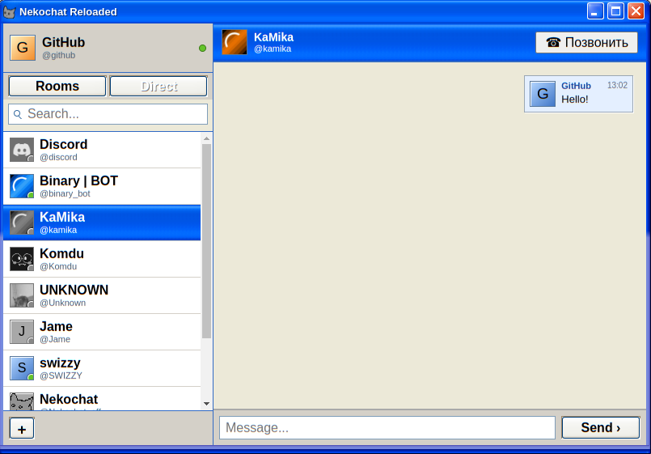

# NekoChat Reloaded

  

*iPhone screenshot by [VASHYAN-CMD](https://github.com/VASHYAN-CMD).*

NekoChat Reloaded is an unofficial Windows XP-style client for NekoChat. It is not the official NekoChat client.

## What the client includes

- Rooms and direct messages.
- Detached chat windows and voice calls with screen sharing and noise suppression.
- Windows XP-inspired themes and an online theme catalog.
- XP-style notification, login, and call sounds.

## Branches

The source code lives in separate branches:

| Branch | Client |
|---|---|
| [`pc`](https://github.com/xKaMikax/nekochat_reloaded/tree/pc) | PC client for Linux and Windows (Electron) |
| [`android`](https://github.com/xKaMikax/nekochat_reloaded/tree/android) | Android client |
| [`iphone`](https://github.com/xKaMikax/nekochat_reloaded/tree/iphone) | iPhone client |

To get the PC client:

```bash
git clone --branch pc git@github.com:xKaMikax/nekochat_reloaded.git
```

To get the Android client:

```bash
git clone --branch android git@github.com:xKaMikax/nekochat_reloaded.git
```

To get the iPhone client:

```bash
git clone --branch iphone git@github.com:xKaMikax/nekochat_reloaded.git
```
