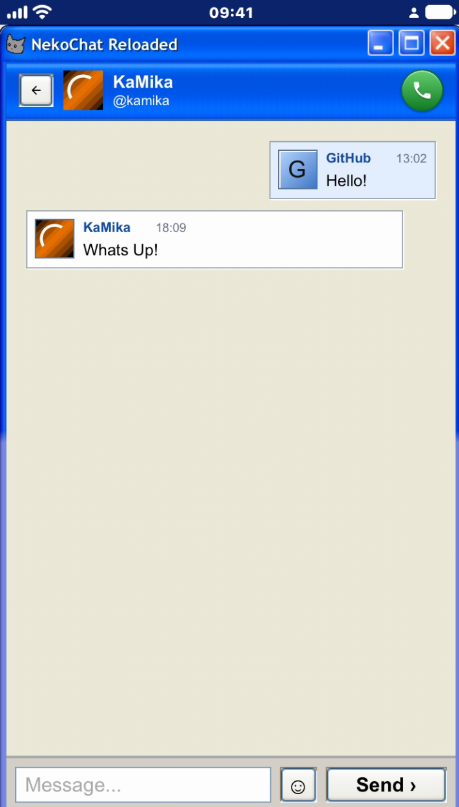

# NekoChat Reloaded — iPhone client



*Screenshot by [VASHYAN-CMD](https://github.com/VASHYAN-CMD).*

> **Warning:** this is a custom NekoChat client, not the official one. The official client is here: https://github.com/xKaMikax/nekochat2linux

NekoChat Reloaded is an unofficial iPhone client for NekoChat. It brings the same Windows XP-style interface as the PC client to iPhone and iPad.

## What the client includes

- Rooms and direct messages.
- Voice calls.
- Windows XP-inspired themes, including themes from the online catalog.
- Message and incoming call notifications.
- XP-style notification, login, and call sounds.

## Download

Every push to this branch builds an unsigned `.ipa` with GitHub Actions. Open the latest **Build IPA** run in the **Actions** tab and download the `NekoChat-Reloaded-1.1-ipa` artifact.

## Install on an iPhone

The `.ipa` is not signed. Install it with a sideloading tool such as [AltStore](https://altstore.io) or [Sideloadly](https://sideloadly.io), which signs it with your Apple ID.

## Build on a Mac

Install Xcode and [XcodeGen](https://github.com/yonaskolb/XcodeGen), then run these commands from the repository root:

```bash
git clone --branch iphone git@github.com:xKaMikax/nekochat_reloaded.git
cd nekochat_reloaded
xcodegen generate
open NekoChatReloaded.xcodeproj
```

Select your team in **Signing & Capabilities** and run the app on your iPhone.
