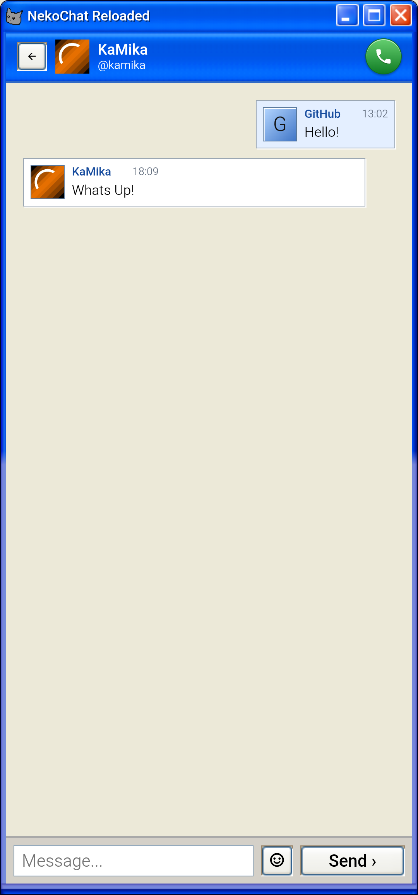

# NekoChat Reloaded — Android client



> **Warning:** this is a custom NekoChat client, not the official one. The official client is here: https://github.com/xKaMikax/nekochat2linux

NekoChat Reloaded is an unofficial Android client for NekoChat. It is the PC client in your pocket: the same Windows XP-style interface instead of using NekoChat in a browser tab.

## What the client includes

- Rooms and direct messages.
- Voice calls and screen sharing.
- Windows XP-inspired themes, including themes from the online catalog.
- Message and incoming call notifications.
- XP-style notification, login, and call sounds.

## Build the APK

Install JDK 17–21 and the Android SDK (platform 36), then run these commands from the repository root:

```bash
git clone --branch android git@github.com:xKaMikax/nekochat_reloaded.git
cd nekochat_reloaded
echo "sdk.dir=$HOME/Android/Sdk" > local.properties
./gradlew assembleDebug
```

The APK will be created in `app/build/outputs/apk/debug/app-debug.apk`.

## Install on a phone

Enable USB debugging on the phone, connect it, and run:

```bash
adb install -r app/build/outputs/apk/debug/app-debug.apk
```
